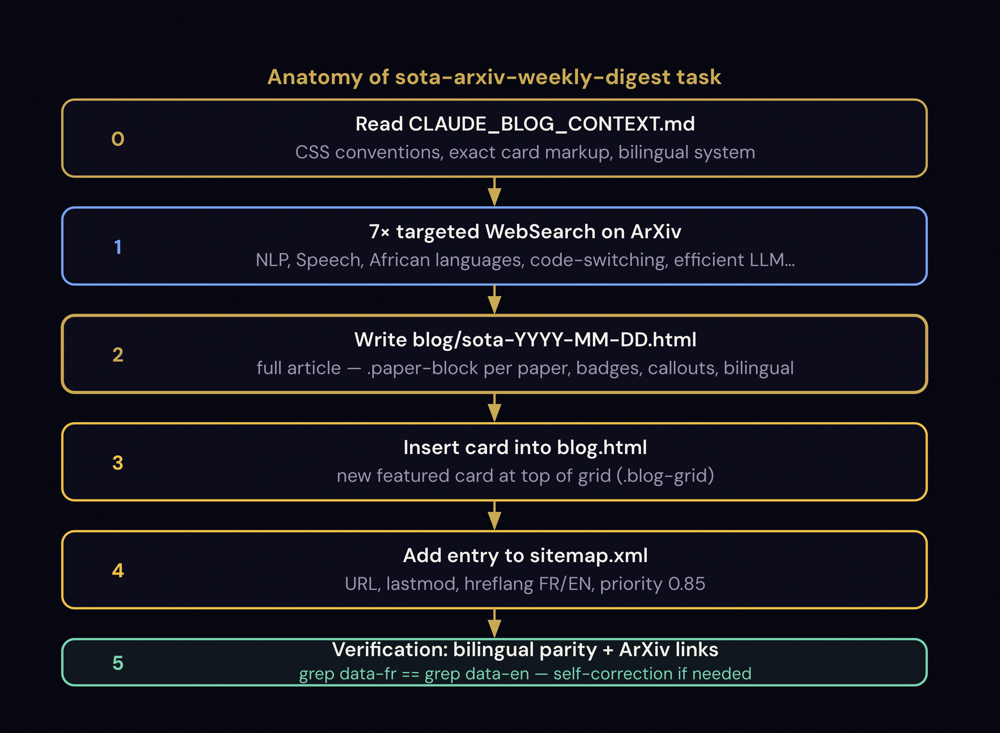

# Automating a Weekly SOTA ArXiv Blog Digest with Claude Cowork

> A complete tutorial on how to set up a fully automated research digest pipeline that searches ArXiv every Sunday, writes a bilingual HTML article, and updates your blog, all without writing a single line of Python or using any API key.

**Author:** Papa Séga WADE: [papasegawade.com](https://papasegawade.com)
**Stack:** Claude Cowork (desktop app) · Static HTML blog · GitHub Pages

---



## Table of Contents

1. [What This Automation Does](#1-what-this-automation-does)
2. [How It Works — Architecture Overview](#2-how-it-works--architecture-overview)
3. [Prerequisites](#3-prerequisites)
4. [Step 1 — Write a Blog Context File (CLAUDE_BLOG_CONTEXT.md)](#4-step-1--write-a-blog-context-file)
5. [Step 2 — Create the Scheduled Task in Cowork](#5-step-2--create-the-scheduled-task-in-cowork)
6. [Step 3 — The Task Prompt in Detail](#6-step-3--the-task-prompt-in-detail)
7. [Step 4 — Pre-approve Tool Permissions](#7-step-4--pre-approve-tool-permissions)
8. [Step 5 — Monday Morning Workflow (5 minutes)](#8-step-5--monday-morning-workflow)
9. [How to Know if an Article Was Written](#9-how-to-know-if-an-article-was-written)
10. [Complementary Weekly Tasks](#10-complementary-weekly-tasks)
11. [Blog HTML Conventions the Agent Must Follow](#11-blog-html-conventions-the-agent-must-follow)
12. [Customizing for Your Own Blog](#12-customizing-for-your-own-blog)
13. [Full Pipeline Summary](#13-full-pipeline-summary)

---

## 1. What This Automation Does

Every **Sunday at 8 PM**, an autonomous Claude agent:

1. Runs **7 targeted ArXiv searches** via WebSearch for your research domains
2. Selects the **5–8 most relevant papers** of the week
3. Identifies the **notable model release of the week** via HuggingFace trending
4. Generates a **complete bilingual HTML article** (French + English) with: per-paper mathematical method blocks, Python snippets, HuggingFace links, Wolof applicability scores, and a "Model of the week" section
5. Inserts a **new card** at the top of your `blog.html` index
6. Adds a new **sitemap.xml entry** for SEO

On **Monday morning**, you open the generated article, review it in your browser, and run `git push` if you're satisfied. The entire research curation and writing takes zero time on your end.

**No API key. No Python script. No server. Just Cowork running on your Mac.**

---

## 2. How It Works — Architecture Overview

```
Sunday 8:00 PM
    │
    ▼
Cowork Scheduled Task: sota-arxiv-weekly-digest
    │
    ├── STEP 0 ── Read CLAUDE_BLOG_CONTEXT.md
    │              (site conventions, CSS classes, bilingual rules, em dash rule)
    │
    ├── STEP 1 ── 7 × WebSearch on arxiv.org
    │              (NLP, Speech, low-resource, African languages, LLMs...)
    │              + WebSearch per paper to get real authors and institutions
    │
    ├── STEP 2 ── WebSearch HuggingFace trending
    │              (identify the notable model release of the week)
    │
    ├── STEP 3 ── Write blog/sota/sota-YYYY-MM-DD.html
    │              (full bilingual article: model-of-the-week + enriched paper-blocks)
    │              (relative paths: ../../css/style.css · ../../js/main.js)
    │              (highlight.js in <head> + script init in <body>)
    │
    ├── STEP 4 ── Update blog.html
    │              (insert new featured card at top of grid)
    │              (card href: "blog/sota/sota-YYYY-MM-DD.html")
    │
    ├── STEP 5 ── Update sitemap.xml
    │              (add new URL with lastmod + priority 0.85)
    │
    ├── STEP 6 ── Verify bilingual parity (FR count == EN count)
    │              and check all arxiv links are present
    │              and verify ../../css/style.css path is correct
    │
    └── STEP 7 ── Summary report (papers count, model found, parity OK)

Monday morning
    │
    └── PSW: open file → review → git push ✅
```

---

## 3. Prerequisites

| Requirement | Details |
|-------------|---------|
| **Claude Cowork** | Desktop app — [claude.ai](https://claude.ai) |
| **Static HTML blog** | Any blog with a predictable file structure |
| **Folder mounted in Cowork** | Your local blog repo must be selected as the workspace folder |
| **No API key needed** | Cowork uses WebSearch natively |
| **No Python needed** | All logic is in the prompt itself |

> **Important:** Cowork must have your blog folder mounted as its workspace. This gives the agent read/write access to your repo files.

---

## 4. Step 1 — Write a Blog Context File

The single most important ingredient is a **`CLAUDE_BLOG_CONTEXT.md`** file at the root of your repo. This file is the agent's memory, it reads it at the start of every run to understand your site's conventions without needing to re-explore the codebase each time.

### What to put in it

```markdown
# My Blog: Context for Claude Cowork

## Site Architecture
(file tree, what each file does)

## CSS Components
(all custom classes with usage examples: .callout, .badge, .paper-block, etc.)

## Bilingual System
(how data-fr/data-en attributes work, how JS switches language)

## Blog Card Structure
(exact HTML markup for inserting a new card in blog.html)

## Article Template
(what the <head>, nav, footer look like, so the agent copies the right structure)

## Existing Articles
(table of all published articles, avoids duplicates)

## Automation Tasks
(table of scheduled tasks, their outputs, what PSW does after each run)
```

### Why this file matters

Without it, the agent would have to read every HTML file in your repo to understand conventions, wasting tokens and risking inconsistencies. With it, the agent has a single source of truth and produces output that matches your existing style exactly.

**Rule:** Every time you make a structural change to your blog (new CSS class, new nav item, renamed file), update `CLAUDE_BLOG_CONTEXT.md`. The agent reads this file on every run.

---

## 5. Step 2 — Create the Scheduled Task in Cowork

In the Cowork desktop app:

1. Open the **Scheduled** section in the sidebar
2. Click **"New task"**
3. Set:
   - **Task ID:** `sota-arxiv-weekly-digest`
   - **Schedule:** `0 20 * * 0`: cron for every Sunday at 8 PM local time
   - **Notify on completion:** ✅ enabled
4. Paste the full prompt (see Step 3 below)
5. Save

The task is now scheduled. It will appear with a `nextRunAt` timestamp showing the next Sunday at ~8 PM.

### Cron expression reference

```
0 20 * * 0
│  │  │ │ └── Day of week (0 = Sunday)
│  │  │ └──── Month (any)
│  │  └────── Day of month (any)
│  └───────── Hour (20 = 8 PM)
└──────────── Minute (0)
```

> **Note:** Cowork applies a small jitter of a few minutes to balance load. Your task will fire at ~8:06 PM, not exactly 8:00 PM. This is normal.

---

## 6. Step 3 — The Task Prompt in Detail

The prompt is the heart of the automation. It must be completely self-contained because the agent runs in a fresh session with no memory of previous conversations.

### Structure of the prompt

```
## STEP 0 — Read context file
   → tells the agent WHERE your conventions are documented
   → includes the em dash rule: never "—" inside sentences

## STEP 1 — ArXiv searches
   → 7 targeted WebSearch queries for your research domains
   → selection criteria (relevance badges, paper count)
   → one extra WebSearch per paper for real author names

## STEP 2 — HuggingFace trending
   → identify the notable open-source model release of the week
   → collect: name, license, sizes, context length, HF model IDs

## STEP 3 — Generate HTML article
   → write to blog/sota/sota-YYYY-MM-DD.html (dedicated subfolder)
   → relative paths use ../../ (two levels up): ../../css/style.css · ../../js/main.js
   → highlight.js loaded in <head>, initialized in <body>
   → model-of-the-week section (if notable model found)
   → enriched paper-block per paper: method + snippet + HF link + Wolof score
   → bilingual attributes on every visible text element

## STEP 4 — Update blog.html
   → exact insertion point (after which HTML element)
   → exact card markup to use (copy your real card structure)

## STEP 5 — Update sitemap.xml
   → exact XML entry to insert
   → where to insert it

## STEP 6 — Verification bash commands
   → bilingual parity check (FR == EN count)
   → ../../css/style.css path check
   → arxiv link count check
```

### The bilingual parity rule

If your blog supports language switching, every text element in the generated article must have both `data-fr` and `data-en` attributes:

```html
<!-- Correct -->
<p data-fr="Texte en français"
   data-en="Text in English">Texte en français</p>

<!-- Wrong — agent will self-correct in Step 6 -->
<p>Texte en français</p>
```

The verification step runs:
```bash
fr=$(grep -c 'data-fr=' "$FILE")
en=$(grep -c 'data-en=' "$FILE")
[ $fr -eq $en ] && echo "OK" || echo "MISMATCH — fix before next step"
```

### Paper block HTML structure (enriched)

Each selected paper gets an enriched `.paper-block` component. The key additions: real authors from WebSearch, a mathematical method block, an optional Python snippet, optional HuggingFace links, and a Wolof applicability score.

```html
<div class="paper-block">
    <div class="paper-block__header">
        <!-- badge--green=direct impact, badge--amber=transferable, badge--gold=general -->
        <span class="badge badge--green" data-fr="🟢 DIRECT" data-en="🟢 DIRECT">🟢 DIRECT</span>
        <!-- Domain: badge--blue for SPEECH | NLP | LLM | ML -->
        <span class="badge badge--blue">SPEECH</span>
    </div>
    <h3 class="paper-block__title">
        <a href="https://arxiv.org/abs/2401.12345" target="_blank" rel="noopener">
            Full Paper Title
        </a>
    </h3>
    <!-- Authors: always use real names from WebSearch, NEVER "Anonyme et al." -->
    <p class="paper-block__authors">
        Firstname Lastname et al. (Institution) · 2025 ·
        <a href="https://arxiv.org/abs/2401.12345" target="_blank" rel="noopener">arXiv:2401.12345</a>
    </p>

    <!-- Summary: no em dash "—" inside sentences. Use ":", ";", "de" instead. -->
    <p class="paper-block__summary"
       data-fr="Résumé sans tiret em dans les phrases : utiliser ':', ';' ou 'de'."
       data-en="Summary without em dashes in prose: use ':', ';', or 'of'.">Résumé...</p>

    <!-- Mathematical method block — always include, 3 lines of intuition -->
    <div class="paper-block__method">
        <span class="method-label" data-fr="Méthode clé" data-en="Key method">Méthode clé</span>
        <p data-fr="(1) nom de la méthode, (2) formule centrale, (3) apport concret."
           data-en="(1) method name, (2) core formula, (3) concrete contribution.">...</p>
    </div>

    <!-- Python snippet — only for papers with direct code applicability (10-15 lines max) -->
    <pre><code class="language-python"># Short runnable snippet, English comments only
</code></pre>

    <!-- HuggingFace resources — only if a public HF model/dataset exists -->
    <div class="paper-block__resources">
        <a href="https://huggingface.co/ORG/MODEL" target="_blank" rel="noopener"
           class="hf-link">🤗 model-name</a>
    </div>

    <!-- Wolof applicability score — always include -->
    <!-- ★★★★★ blueprint direct | ★★★★☆ strongly transferable | ★★★☆☆ moderate | ★★☆☆☆ indirect | ★☆☆☆☆ minimal -->
    <div class="paper-block__wolof-score">
        <span class="score-label" data-fr="Pertinence Wolof" data-en="Wolof relevance">Pertinence Wolof</span>
        <span class="score-stars">★★★☆☆</span>
        <span data-fr="(justification 1 phrase)" data-en="(1-sentence justification)">(justification)</span>
    </div>

    <div class="paper-block__footer">
        <a href="https://arxiv.org/abs/2401.12345" target="_blank" rel="noopener"
           class="paper-block__link">arxiv.org/abs/2401.12345 →</a>
    </div>
</div>
```

### Model of the week block

If a notable open-source model was released this week, add this section before the paper blocks:

```html
<div class="model-of-the-week">
    <div class="model-of-the-week__header">
        <span class="model-badge" data-fr="Modèle de la semaine" data-en="Model of the week">Modèle de la semaine</span>
        <h2 class="model-of-the-week__title"
            data-fr="MODEL_NAME de ORGANIZATION"
            data-en="MODEL_NAME by ORGANIZATION">MODEL_NAME de ORGANIZATION</h2>
    </div>
    <!-- No em dash in description sentences -->
    <p data-fr="Description : licence, capacités, pertinence pour les langues africaines."
       data-en="Description: license, capabilities, relevance for African languages.">...</p>

    <div class="model-of-the-week__specs">
        <div class="model-spec">
            <div class="model-spec__key" data-fr="Licence" data-en="License">Licence</div>
            <div class="model-spec__value">Apache 2.0</div>
        </div>
        <!-- repeat for Tailles/Sizes, Contexte/Context, Langues/Languages -->
    </div>

    <div class="paper-block__resources">
        <a href="https://huggingface.co/ORG/MODEL_ID" target="_blank" rel="noopener"
           class="hf-link">🤗 model-id</a>
    </div>

    <div class="paper-block__wolof-score">
        <span class="score-label" data-fr="Pertinence Wolof" data-en="Wolof relevance">Pertinence Wolof</span>
        <span class="score-stars">★★★★☆</span>
        <span data-fr="(justification)" data-en="(justification)">(justification)</span>
    </div>
</div>
```

### Critical: give the agent your EXACT blog card markup

The most common failure point is the agent inserting a card with the wrong HTML structure. Fix this by including your exact card markup in the prompt, copied from your real `blog.html`:

```html
<!-- This is what YOUR blog uses — copy it exactly into your prompt -->
<article class="blog-card blog-card--featured" data-category="llm">
    <div class="blog-card__meta">
        <span class="blog-card__category" data-fr="SOTA · ArXiv" data-en="SOTA · ArXiv">SOTA · ArXiv</span>
        <span class="blog-card__date" data-fr="[DATE_FR]" data-en="[DATE_EN]">[DATE_FR]</span>
    </div>
    <h2 class="blog-card__title" data-fr="..." data-en="...">...</h2>
    <p class="blog-card__excerpt" data-fr="..." data-en="...">...</p>
    <a href="blog/sota/sota-YYYY-MM-DD.html" class="blog-card__link"
       data-fr="Lire le digest →" data-en="Read digest →">Lire le digest →</a>
</article>
```

> **Note on paths:** the article lives in `blog/sota/sota-YYYY-MM-DD.html` (two levels deep). Inside the article, all asset paths use `../../` (e.g., `../../css/style.css`). The card's `href` in `blog.html` is `blog/sota/sota-YYYY-MM-DD.html` (relative to site root).

> **Lesson learned:** Don't describe the card structure in words. Paste the actual HTML. The agent copies it exactly and fills in the variables.

---

## 7. Step 4 — Pre-approve Tool Permissions

**This step is mandatory before the first automatic run.**

1. In Cowork → Scheduled, find `sota-arxiv-weekly-digest`
2. Click **"Run now"**
3. Cowork will ask for permission to use **WebSearch** and **write files** to your workspace
4. Grant both permissions

These approvals are stored on the task and auto-applied to all future automatic runs. Without this step, the first Sunday run will pause mid-execution waiting for permission and produce nothing.

---

## 8. Step 5 — Monday Morning Workflow

After the Sunday run, you receive a Cowork notification. Monday morning:

```bash
cd ~/Desktop/your-blog-repo

# 1. See what was generated
git status
git diff --stat

# 2. Open the article in your browser
open blog/sota/sota-2026-04-06.html

# 3. Review: check paper summaries, links, layout
#    - Are the arxiv links valid?
#    - Are the paper summaries accurate?
#    - Does the card look right on blog.html?

# 4. If satisfied — push
git add blog/sota/sota-2026-04-06.html blog.html sitemap.xml
git commit -m "feat: SOTA ArXiv digest week 15 2026-04-06"
git push
```

**Total time: ~5 minutes.** The agent does the research and writing. You do the editorial judgment.

---

## 9. How to Know if an Article Was Written

### Method 1 — Cowork notification
You receive an in-app notification when the task completes. This is the easiest signal.

### Method 2 — Check the file directly
```bash
ls ~/Desktop/your-blog-repo/blog/sota/sota-*.html
# Output: blog/sota/sota-2026-04-06.html  ← article was written
# Output: (empty)                          ← task failed or hasn't run yet
```

### Method 3 — git status
```bash
cd ~/Desktop/your-blog-repo && git status
# You should see 3 modified files:
#   modified:   blog.html
#   modified:   sitemap.xml
#   new file:   blog/sota/sota-2026-04-06.html
```

### Method 4 — Check Cowork run history
In Cowork → Scheduled → `sota-arxiv-weekly-digest`, the `lastRunAt` timestamp shows the most recent execution time.

### What to do if the task ran but produced nothing

This usually means tool permissions were not pre-approved. Fix:
1. Click "Run now" again
2. Grant WebSearch + file write permissions when prompted
3. The task will complete successfully this time
4. Future automatic runs will work without prompts

---

## 10. Complementary Weekly Tasks

Two additional tasks pair naturally with the SOTA digest:

### `huggingface-weekly-report`: Saturday 7 PM

Searches HuggingFace Hub for new models and datasets in your research domains. Output: `docs/hf-weekly-YYYY-MM-DD.md`, a private Markdown report (gitignored). Read it before reviewing the SOTA digest on Monday morning.

**Cron:** `0 19 * * 6`

### `arxiv-daily-digest`: Manual trigger

On-demand ArXiv search for the last 48 hours. Useful when you want a quick pulse check mid-week, or when a major paper drops and you want a same-day summary.

**Schedule:** Manual only (no cron, trigger from Cowork when needed)

### Keeping reports private

Both `docs/` reports are gitignored, they never appear in your public repo:

```gitignore
# Internal reports, local use only, never commit
docs/hf-weekly-*.md
docs/arxiv-daily-*.md
```

---

## 11. Blog HTML Conventions the Agent Must Follow

These are the conventions from `papasegawade.com`, adapt them for your own blog.

### CSS file

Articles in `blog/sota/` are two levels deep, so all paths use `../../`:
```html
<link rel="stylesheet" href="../../css/style.css">
<link rel="icon" type="image/svg+xml" href="../../img/favicon.svg">
<script src="../../js/main.js"></script>
```

Articles in `blog/` (one level deep) use `../`:
```html
<link rel="stylesheet" href="../css/style.css">
```

All utility classes are in `css/style.css`. No inline `<style>` blocks in generated articles.

### Available CSS components (already in style.css)

| Class | Purpose |
|-------|---------|
| `.paper-block` | ArXiv paper card container |
| `.paper-block__method` | Mathematical method block (gold left border, secondary background) |
| `.method-label` | Label "Méthode clé" in uppercase gold |
| `.paper-block__resources` | Row of HuggingFace resource links |
| `.hf-link` | HuggingFace link pill (gold border, hover fill) |
| `.paper-block__wolof-score` | Wolof applicability score row with stars |
| `.score-stars` | Gold star characters (★★★☆☆ style) |
| `.model-of-the-week` | Model of the week card (gold border, featured background) |
| `.model-of-the-week__specs` | Grid of model specs (license, sizes, context, languages) |
| `.model-badge` | "Modèle de la semaine" pill badge |
| `.callout` | Highlighted note block (gold border) |
| `.callout--warn` | Warning variant (amber) |
| `.callout--success` | Success variant (green) |
| `.badge--green` | Relevance: direct impact |
| `.badge--amber` | Relevance: transferable methodology |
| `.badge--gold` | Relevance: general LLM foundation |
| `.badge--blue` | Domain tag (LLM, SPEECH, NLP, ML) |
| `.stat-grid` | 3-column KPI card grid |
| `.lang-hint` | Bilingual notice banner |

### Bilingual system

Every visible text element needs both attributes:

```html
<h1 data-fr="Titre en français" data-en="English title">Titre en français</h1>
<p  data-fr="Contenu FR" data-en="EN content">Contenu FR</p>
```

The default language (French) is set on `<html data-lang="fr">`. JavaScript in `main.js` handles switching. Parity must be exact: `grep -c 'data-fr='` must equal `grep -c 'data-en='`.

---

## 12. Customizing for Your Own Blog

### Adapt the ArXiv search queries

In the task prompt, replace the 7 search queries with your own research domains:

```
site:arxiv.org "your domain" "your keywords" 2026
```

Examples for different research areas:
- Computer vision: `site:arxiv.org "object detection" "transformer" efficient 2026`
- Robotics: `site:arxiv.org "reinforcement learning" "robot manipulation" 2026`
- Bioinformatics: `site:arxiv.org "protein structure" "language model" 2026`

### Adapt the relevance badges

Change the badge labels to match your relevance criteria:

```
high    → direct application to your main use case
medium  → transferable methodology
ambient → general advancement in your field
```

### Adapt the HTML template

The generated article template in the prompt must match your blog's `<head>`, nav, and footer structure exactly. Copy these from your `template-article.html` and paste them into the prompt.

### Adapt the file naming convention

The prompt uses `blog/sota/sota-YYYY-MM-DD.html`. Change this to match your blog's convention:
- `blog/digest/digest-YYYY-MM-DD.html`
- `blog/weekly/weekly-YYYY-WW.html`
- `blog/arxiv/arxiv-wNN-YYYY.html`

### Monolingual blogs

If your blog is monolingual, remove all `data-fr`/`data-en` attributes from the template and the bilingual parity verification step.

---

## 13. Full Pipeline Summary

```
Every week, automatically:

SAT 19:00 → huggingface-weekly-report
             └─ docs/hf-weekly-YYYY-MM-DD.md (private)
                New HuggingFace models & datasets in your domains

SUN 20:00 → sota-arxiv-weekly-digest
             ├─ blog/sota/sota-YYYY-MM-DD.html  (new article)
             ├─ blog.html                        (new card at top)
             └─ sitemap.xml                      (new URL entry)

MON ~09:00 → YOU
             └─ open blog/sota/sota-*.html
                review 5 minutes
                git push ✅
```

**Time investment:** ~5 minutes/week for editorial review.
**Output:** 52 research digest articles/year, fully indexed, bilingual, SEO-ready.

---

## Key Lessons Learned

**1. The context file is everything.**
A well-maintained `CLAUDE_BLOG_CONTEXT.md` is what makes the agent produce consistent output. Treat it as living documentation, update it whenever your site structure changes.

**2. Paste exact HTML, don't describe it.**
The most reliable way to get the agent to insert correct markup is to paste the actual HTML from your existing files into the prompt. The agent copies it literally and fills in variables.

**3. Pre-approve permissions before the first run.**
This is the #1 reason first runs fail. Always click "Run now" manually once before relying on the automatic schedule.

**4. The agent needs verification steps.**
Include bash commands at the end of the prompt that the agent runs on itself. This catches bilingual parity issues, missing links, and empty paper blocks before you review.

**5. Keep internal reports out of git.**
Research reports (`docs/hf-weekly-*.md`, etc.) are useful locally but shouldn't be in your public repo. Add them to `.gitignore` before the first run.

**6. Never use em dashes inside sentences.**
In bilingual HTML articles, the rule is strict: never use "—" inside prose sentences or `data-fr`/`data-en` attributes. Use ":", ";", or "de" instead. Em dashes are only acceptable inside HTML `<title>`, `<h1>`, `<h2>` tags and meta title attributes. Enforce this rule in your task prompt so the agent follows it from the start.

**7. Fetch real authors, never leave placeholders.**
The agent's default is to write "Author et al." when it can't fetch the ArXiv page directly. Always include an explicit instruction in the prompt to run a WebSearch per paper to retrieve real author names and institutions before writing the article.

**8. Enrich, don't just summarize.**
A digest is most useful to researchers when it goes beyond the abstract. The per-paper mathematical method block (3 lines of intuition), the Wolof applicability score, and the Python snippet are what differentiate this digest from a simple RSS feed. Include all three in your paper-block template and your prompt.

---

*Built and documented by [Papa Séga WADE](https://papasegawade.com), April 2026.*
*Research domains: NLP · Speech · Low-resource African languages · LLMs · Code-switching*
